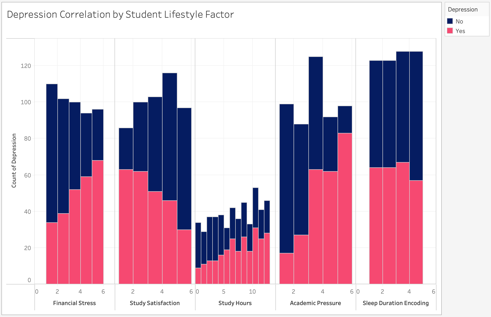

<!-- A shared color scale for consistency, sorted by the number of launches -->
<style>
.no-max-width {
    font-size: 50px;
    max-width: none;
}

.large-data-card{
    padding: 1.5rem;
    font: 14px var(--sans-serif);
    grid-row: span 6;
}

body{
  margin: 0;
  padding: 0.1rem; /* More space between body edge and .section blocks */
  max-width: 100vw;
  font-family: var(--sans-serif);
  box-sizing: border-box;
  overflow: hidden; /* Prevent body-level scrolling */
}
.section {
  position: absolute;
  width: 100%; /* Full width of the viewport */
  height: 100vh;
  margin: 0 auto; /* Center the content */
  padding: 1rem; /* Add some padding for spacing */
  box-sizing: border-box; /* Include padding in width calculation */
  overflow-y: auto; /* Allow section-level scrolling */
  margin-bottom: 20vh;
  opacity: 0;
  visibility: hidden;
  transition: opacity 0.25s ease;
  z-index: 0;
}

.section.active {
      opacity: 1;
      visibility: visible;
      z-index: 1;
    }

.section-content {
      margin: 0 auto;
    }

.scroll-button {
      position: fixed;
      left: 50%;
      transform: translateX(-50%);
      padding: 15px 30px;
      font-size: 1rem;
      /* background-color: #007BFF; */
      color: white;
      border: none;
      border-radius: 25px;
      cursor: pointer;
      box-shadow: 0 4px 10px rgba(0,0,0,0.2);
      z-index: 10;
      opacity: 1;
      transition: opacity 0.3s ease;
    }

    .scroll-button:hover {
      background-color: #0056b3;
    }

    .scroll-button.hidden {
      opacity: 0;
      pointer-events: none;
    }

    #scroll-down {
      bottom: 20px;
    }

    #scroll-up {
      top: 20px;
    }

.card-borderless {
    padding: 1rem;
    margin: 1rem 0;
    font: 14px var(--sans-serif);
}

#prediction-results p {
    font-size: 16px; /* Match the font size of other paragraphs */
    color: inherit;  /* Inherit the color from the parent container */
    line-height: 1.5; /* Match the line height for better readability */
    margin: 0.5rem 0; /* Add consistent spacing between lines */
}
</style>

<!-- SLIDE 1:  -->
<body>
<div class="section" id="section-0">
<div class = "section-content">


<div class="grid grid-cols-2">

  <!-- Page Title div -->
  <div class="card-borderless grid-colspan-4 grid-rowspan-1" style="display: flex; justify-content: center; align-items: center; text-align: center;">
      <h1 class="no-max-width">
        Mapping Mental Health: Predicting Student Depression Risk
      </h1>
  </div>

  <!-- Insight div -->
  <div class="card-borderless grid-rowspan-3">
    <h1>Our interactive tool lets you explore which lifestyle factors impact depression among students - and see how your habits compare. </h1>
  </div>

  <!-- Data div -->
  <div class="large-data-card" id="chart-container" style="display: flex; justify-content:center; flex-wrap: wrap;">
    <h2>Our Data</h2>
    ${display(createChart())}

  </div>

  <!-- User Interaction Div -->
  <div class="card-borderless grid-colspan-1 grid-rowspan-3">
    <h1 style="font-size: 15px;">Created by: </h1>
    <p>Srinidhi Jayaprakash, Diego Rivas Lazala, Molly Fei, Stephen Park </p>
  </div>
</div>
</div>
</div>

<!-- SLIDE 2:  -->
<div class="section" id="section-1">
<div class = "section-content">

<div class="grid grid-cols-2">
  <!-- Page Title div -->
  <div class="card-borderless grid-colspan-4 grid-rowspan-1" style="display: flex; justify-content: center; align-items: center; text-align: center;">
      <h1 class="no-max-width">
        What Does the Data Say?
      </h1>
  </div>
  <!-- Insight div -->
  <div class="card-borderless grid-rowspan-3">
    <h1>Explore how sleep, diet, study time, and more relate to Student Depression. </h1>
  </div>
  <!-- Data div -->
  <div class="large-data-card" id="chart-container" style="display: flex; justify-content:center; flex-wrap: wrap;">
    <h2>Exploring the Data</h2>
    ${display(createChart())}

  </div>
  <!-- User Interaction Div -->
  <div class="card-borderless grid-colspan-1 grid-rowspan-3">
    <h1 style="font-size: 15px;">Click on each bubble to see details on each student data point. </h1>
  </div>
</div>
</div>
</div>

<!-- Feature Cards:  -->
<div class="section" id="section-2">
<div class = "section-content">
<div class="grid grid-cols-2">
  <!-- Page Title div -->
  <div class="card-borderless grid-colspan-4 grid-rowspan-1" style="display: flex; justify-content: center; align-items: center; text-align: center;">
      <h1 class="no-max-width">
        What Does Your Age and Gender Say?
      </h1>
  </div>
  <!-- Insight div -->
  <div class="card-borderless grid-rowspan-3">
    <h1>Insights</h1>
    <h1></h1>
    Younger students tend to report higher levels of depression, possibly due to transitional stress and academic pressure. Additionally, female and non-binary students show higher average depression scores compared to male students, reflecting broader mental health disparities across gender identities.
  </div>
  <!-- Data div -->
  <div class="large-data-card" id="chart-container" style="display: flex; justify-content:center; flex-wrap: wrap;">
    <div id="chart-container-age"><h1>Depression by Age</h1><br><br> ${view(startAge)} </div>
    <div id="chart-container-gender"><h1>Depression by Gender</h1> ${view(startGender)}</div>

  </div>
  <!-- User Interaction Div -->
  <div class="card-borderless grid-colspan-1 grid-rowspan-3">
    <h1 style="font-size: 15px;">Curious where you fit in?</h1><br><br>
    <p> Enter Your Age: ${view(ageInput)} </p> <br><br><br>
    <p> Enter Your Gender: ${view(genderInput)}</p>
  </div>
</div>
</div>
</div>


<!-- Feature Cards:  -->
<div class="section" id="section-3">
<div class = "section-content">
<div class="grid grid-cols-2">
  <!-- Page Title div -->
  <div class="card-borderless grid-colspan-4 grid-rowspan-1" style="display: flex; justify-content: center; align-items: center; text-align: center;">
      <h1 class="no-max-width">
        What Do Your Academic Pressure Levels Say?
      </h1>
  </div>
  <!-- Insight div -->
  <div class="card-borderless grid-rowspan-3">
    <h1>Insight for this feature</h1>
    <h1></h1>
    As academic pressure increases, we observe a clear uptick in reported depression levels. Students who rate their academic pressure between 3 and 5 show significantly higher rates of depression than those under less pressure.
  </div>
  <!-- Data div -->
  <div class="large-data-card" id="chart-container" style="display: flex; justify-content:center; flex-wrap: wrap;">
    <h1>Depression by Academic Pressure Levels</h1>
    ${view(startAcademic)}
    ${view(chart("Academic Pressure",startAcademic))}

  </div>
  <!-- User Interaction Div -->
  <div class="card-borderless grid-colspan-1 grid-rowspan-3">
    <h1 style="font-size: 15px;">Curious where you fit in?</h1>
    <p> Rate your academic pressure on a scale from 1 to 5 </p>
    ${view(academicPressureInput)}
  </div>
</div>

</div>
</div>

<!-- Feature Cards:  -->
<div class="section" id="section-4">
<div class = "section-content">

<div class="grid grid-cols-2">
  <!-- Page Title div -->
  <div class="card-borderless grid-colspan-4 grid-rowspan-1" style="display: flex; justify-content: center; align-items: center; text-align: center;">
      <h1 class="no-max-width">
        What Do Your Sleep Habits Say?
      </h1>
  </div>
  <!-- Insight div -->
  <div class="card-borderless grid-rowspan-3">
    <h1>Insight for this feature</h1>
    <h1></h1>
    While there isn't a strong correlation between sleep duration and depression, students who sleep fewer than 6 hours per night tend to report slightly higher levels of depression compared to their peers.
  </div>
  <!-- Data div -->
  <div class="large-data-card" id="chart-container" style="display: flex; justify-content:center; flex-wrap: wrap;">
    <h1>Depression by Number of Sleep Hours</h1>
    ${view(startSleep)}
    
  </div>
  <!-- User Interaction Div -->
  <div class="card-borderless grid-colspan-1 grid-rowspan-3">
    <h1 style="font-size: 15px;">Curious where you fit in?</h1>
    <p> Rate your sleep hours on a scale from 1 to 5 </p>
    ${view(sleepInput)}
  </div>
</div>

</div>
</div>

<!-- Feature Cards:  -->
<div class="section" id="section-5">
<div class = "section-content">

<div class="grid grid-cols-2">
  <!-- Page Title div -->
  <div class="card-borderless grid-colspan-4 grid-rowspan-1" style="display: flex; justify-content: center; align-items: center; text-align: center;">
      <h1 class="no-max-width">
        What Do Your Study Habits and Study Hours Say?
      </h1>
  </div>
  <!-- Insight div -->
  <div class="card-borderless grid-rowspan-3">
    <h1>Insights</h1>
    <br>
    Higher satisfaction with studying is linked to lower depression counts; higher study satisfaction can lead to better mental well-being by fostering a sense of accomplishment and reducing stress. <br><br>
    Increased study hours often correlate with higher levels of depression, suggesting that overworking can lead to burnout. 
  </div>
  <!-- Data div -->
  <div class="large-data-card" id="chart-container" style="display: flex; justify-content:center; flex-wrap: wrap;">
    <h1>Depression by Study Satisfaction Levels</h1>
    ${view(startSatisfaction)}
    ${view(chart("Study Satisfaction",startSatisfaction))}
    <h1>Depression by Study Hour Levels</h1>
    <!********NEED A STUDY HOUR VIZ HERE*********!>
    
  </div>
  <!-- User Interaction Div -->
  <div class="card-borderless grid-colspan-1 grid-rowspan-3">
    <h1 style="font-size: 15px;">Curious where you fit in?</h1>
    <p> Rate your study satisfaction on a scale from 1 to 5 </p>
    ${view(studySatisfactionInput)}
    <br><br><br><br>
    <p> Enter the amount of hours you typically study weekly </p>
    ${view(studyHoursInput)}
  </div>
</div>
</div>
</div>


<!-- Feature Cards:  -->
<div class="section" id="section-6">
<div class = "section-content">

<div class="grid grid-cols-2">
  <!-- Page Title div -->
  <div class="card-borderless grid-colspan-4 grid-rowspan-1" style="display: flex; justify-content: center; align-items: center; text-align: center;">
      <h1 class="no-max-width">
        What Does Your Financial Stress Say?
      </h1>
  </div>
  <!-- Insight div -->
  <div class="card-borderless grid-rowspan-3">
    <h1>Insight for this feature</h1>
    <h1></h1>
    Similar to academic pressure, higher financial stress is strongly linked to increased depression rates. Constant worry about finances, such as debt or instability, can lead to feelings of helplessness and anxiety, which negatively impact mental health and contribute to depression.
  </div>
  <!-- Data div -->
  <div class="large-data-card" id="chart-container" style="display: flex; justify-content:center; flex-wrap: wrap;">
    <h1>Depression by Financial Stress Levels</h1>
    ${view(startFinancialStress)}
    ${view(chart("Financial Stress",startFinancialStress))}
    
  </div>
  <!-- User Interaction Div -->
  <div class="card-borderless grid-colspan-1 grid-rowspan-3">
    <h1 style="font-size: 15px;">Curious where you fit in?</h1>
    <p> Rate your financial stress on a scale from 1 to 5 </p>
    ${view(financialStressInput)}
  </div>
</div>
</div>
</div>


<!-- Insights Summary Card:  -->
<div class="section" id="section-7">
<div class = "section-content">

<div class="grid grid-cols-2">
  <!-- Page Title div -->
  <div class="card-borderless grid-colspan-4 grid-rowspan-1" style="display: flex; justify-content: center; align-items: center; text-align: center;">
      <h1 class="no-max-width">
        Insights Summary from Lifestyle Factors
      </h1>
  </div>
  <!-- Insight div -->
  <div class="card-borderless grid-rowspan-3" style="grid-row: span 6;">
    <br><h1 style="font-size: 20px;">What patterns emerge when we compare student life habits with reported depression? Our data shows clear trends between specific stressors and mental health outcomes.?</h1>
    <h1></h1>
    <br><br>
    <p style="font-size: 18px;">Financial Stress: Similar to academic pressure, higher financial stress is strongly associated with higher depression rates.<br><br><br>
    Study Satisfaction: Higher satisfaction with studying is linked to lower depression counts.<br><br><br>
    Academic Pressure: As academic pressure increases, the count of students with depression also increases.<br><br><br>
    Study Hours: More study hours tend to correlate with higher depression, possibly pointing to overwork or burnout.<br><br><br>
    Sleep Duration: Students sleeping less than 6 hours have a slightly higher count of depression, although not a significant difference.</p>
  </div>
  <!-- Data div -->
  <div class="large-data-card" id="chart-container" style="display: flex; justify-content:center; flex-wrap: wrap;">
    <h1>Depression by Financial Stress Levels</h1>
    
  </div>
</div>
</div>
</div>

 <!-- ML Predictor Card -->
 <div class="section" id="section-8">
<div class = "section-content">

<div class="grid grid-cols-2">
  <!-- Page Title div -->
  <div class="card-borderless grid-colspan-4 grid-rowspan-1" style="display: flex; justify-content: center; align-items: center; text-align: center;">
      <h1 class="no-max-width">
        Can We Predict If You Are at Risk of Depression?
      </h1>
  </div>
  <!-- Insight div -->
  <div class="card-borderless grid-rowspan-3" style="grid-row: span 6;">
    <h1 style="font-size: 20px;">This tool uses a machine learning model to analyze your lifestyle factors and predict whether you might be at a higher risk of depression. By considering inputs such as dietary habits, suicidal thoughts, family history of mental illness, and more, the model provides a personalized prediction based on your profile.</h1>
    <br>
    
  </div>
  <!-- Data div -->
  <div class="large-data-card" id="chart-container">
    <p style="font-size: 16px;"> To use this tool: </p>
    <ul style="font-size: 16px;">
      <li>Review the information you’ve entered on previous pages, including your gender, age, study satisfaction, sleep and more.</li>
      <li>To provide a more accuracte prediction, we need more information on your dietary habits, whether you've had suicidal thoughts and familial history of mental illness; all of which can be entered below. </li>
      <li>If you’re ready, press the <strong>"Get Prediction"</strong> button to see the prediction based on your profile.</li>
      <li>The result will indicate whether the model predicts a higher or lower risk of depression, along with the confidence level of the prediction.</li>
    </ul>
    <br>
      <!-- TODO: allow the user to see what they have entered before hand -->
    <!-- input from previous pages: gender, age-->
    <!-- ${view(genderInput)}
    ${view(ageInput)} -->
    <!-- ${view(studySatisfactionInput)}  -->
    <!-- ${view(sleepInput)} -->
    ${view(dietInput)}
    <!-- ${view(academicPressureInput)} -->
    ${view(suicideThoughtsInput)}
    <!-- ${view(studyHoursInput)} -->
    <!-- ${view(financialStressInput)} -->
    ${view(familyHistory)}
    <br>
    ${display(submitUserProfile)}
    <div id="prediction-results" style="margin-top: 20px;">
      <!-- Results will be displayed here -->
    </div>
  </div>
</div>
</div>
</div>

  <!-- Mental Health Resources  Card -->
<div class="section" id="section-8">
<div class = "section-content">

<div class="grid grid-cols-2">
  <!-- Page Title div -->
  <div class="card-borderless grid-colspan-4 grid-rowspan-1" style="display: flex; justify-content: center; align-items: center; text-align: center;">
      <h1 class="no-max-width">
        Mental Health Matters
      </h1>
  </div>
  <!-- Insight div -->
  <div class="card-borderless grid-rowspan-3" style="grid-row: span 6;">
    <br><h1 style="font-size: 20px;">This machine learning tool is not a medical diagnosis but a reflective resource to help identify patterns in student life related to depression. If you or someone you know is struggling, we strongly encourage seeking support through university counseling services or national mental health resources.</h1>
  </div>
  <!-- Data div -->
  <div class="large-data-card" id="chart-container">
  <br><h1>Links to Resources: </h1>
  <br><br>
  <p>https://www.nimh.nih.gov/get-involved/digital-shareables/mental-health-resources-for-students-and-educators</p><br>
  <p>https://www.mentalhealthfirstaid.org/mental-health-resources/</p><br>
  <p>https://opa.hhs.gov/adolescent-health/mental-health-adolescents/mental-health-resources</p><br>
  <p>https://mhanational.org/youth-mental-health/</p><br>
  </div>
</div>
</div>
</div>

<!-- loading chart data-->
```js
// pulling in the JSON created from the csv 
const data = FileAttachment("./data/data.json").json();
```

<!-- chart definition -->
```js
// displaying the json created from the depression data csv
// display(data);

// displaying the d3 svg node created from the depression data
function createChart(){
  const displayData = data; // Modify this if you need to filter or transform the data
  const width = 500, height = 600, margin = { top: 80, right: 50, bottom: 120, left: 50 };
  const r = 8; // Fixed radius
  
  const svg = d3.create("svg")
    .attr("width", width)
    .attr("height", height)
    // .style("background-color", "#F0F0F0");
  
  const g = svg.append("g")
    .attr("transform", `translate(${margin.left}, ${margin.top})`);
  
  const xScale = d3.scaleLinear()
    .domain([0, displayData.length - 1])
    .range([0, width - margin.left - margin.right]);
  
  const yScale = d3.scaleLinear()
    .range([height - margin.top - margin.bottom, 0]);
  
  const yTargets = displayData.map(() => Math.random() * (height - margin.top - margin.bottom));
  
  const simulation = d3.forceSimulation(displayData)
    .force("x", d3.forceX((d, i) => xScale(i)).strength(0.05))
    .force("y", d3.forceY((d, i) => yTargets[i]).strength(0.05))
    .force("collide", d3.forceCollide(r + 4))
    .force("charge", d3.forceManyBody().strength(2))
    .stop();
  
  for (let i = 0; i < 200; ++i) simulation.tick();
  
  const circles = g.selectAll("circle")
    .data(displayData, (d, i) => i);
  
  circles.enter()
    .append("circle")
    .attr("cx", d => d.x)
    .attr("cy", d => d.y)
    .attr("r", r * 1.5)
    .attr("fill", d =>
      d.newEntry ? "#4A90E2" : (d.Depression.toLowerCase() === "yes" ? "#D81B60" : "none")
    )
    .attr("stroke", "#9C1C6C")
    .attr("stroke-width", 1.2)
    .attr("opacity", 0)
    .transition()
    .duration(800)
    .attr("opacity", 1)
    .attr("r", r);
  
  svg.append("text")
    .attr("x", width / 2)
    .attr("y", margin.top / 2)
    .attr("text-anchor", "middle")
    .attr("font-size", "24px")
    .attr("font-weight", "bold")
  
  const tooltip = d3.select("body").append("div")
    .attr("class", "tooltip")
    .style("position", "absolute")
    .style("background", "white")
    .style("padding", "10px")
    .style("border", "1px solid #ccc")
    .style("border-radius", "8px")
    .style("pointer-events", "none")
    .style("font-size", "12px")
    .style("color", "#333")
    .style("box-shadow", "0px 2px 8px rgba(0,0,0,0.15)")
    .style("opacity", 0);
  
  g.selectAll("circle")
    .on("mouseover", function (event, d) {
      tooltip.transition()
        .duration(200)
        .style("opacity", 0.95);
  
      tooltip.html(`
        <strong>Gender:</strong> ${d.Gender}<br/>
        <strong>Age:</strong> ${d.Age}<br/>
        <strong>Academic Pressure:</strong> ${d["StudySatisfaction"]}<br/>
        <strong>Sleep Duration:</strong> ${d["SleepDuration"]}<br/>
        <strong>Dietary Habits:</strong> ${d["DietaryHabits"]}<br/>
        <strong>Suicidal Thoughts:</strong> ${d["SuicidalThoughts"]}<br/>
        <strong>Study Hours:</strong> ${d["StudyHours"]}<br/>
        <strong>Financial Stress:</strong> ${d["FinancialStress"]}<br/>
        <strong>Family History:</strong> ${d["FamilyHistory"]}<br/>
        <strong>Depression:</strong> ${d.Depression}
      `);
    })
    .on("mousemove", function (event) {
      tooltip
        .style("left", (event.pageX + 15) + "px")
        .style("top", (event.pageY - 20) + "px");
    })
    .on("mouseout", function () {
      tooltip.transition()
        .duration(300)
        .style("opacity", 0);
    });
  
  return svg.node();
}
```

<!-- Storing the user's input for the ML predictor -->
```js
let genderInput = Inputs.select([null,"Male","Female","Not Specified"], {label: "Gender"});
let ageInput = Inputs.range([18,35], {value: 18, step: 1, label: "Age"}); // range function
let studySatisfactionInput = Inputs.select(([null,1,2,3,4,5]), {label: "Study Satisifcation", placeholder:""});
let sleepInput = Inputs.select(([null,"Less than 5 hours","5-6 hours","7-8 hours","More than 8 hours"]), {label: "Sleep Duration"});
let dietInput = Inputs.select(([null,"Unhealthy","Moderate","Healthy"]), {label: "Dietary Habits", placeholder:""});
let academicPressureInput = Inputs.select([1,2,3,4,5], {step: 1, label: "Academic Pressure"}); // range function
let suicideThoughtsInput = Inputs.select(([null,"Yes","No"]), {label: "Have you ever had suicidal thoughts?", placeholder:""});
let studyHoursInput = Inputs.range([0,24], {value: 0, step: 1, label: "Study Hours"});
let financialStressInput = Inputs.select(([null,1,2,3,4,5]), {label: "Financial Stress", placeholder:""});
let familyHistory = Inputs.select(([null,"Yes","No"]), {label: "Family History of Mental Illness"});
let realDepression = Inputs.select(([null,"Yes","No"]), {label: "Do you have depression?", placeholder:""});

// Alternative approach with a mutable object and update function
let userProfile = {
  "Gender": null,
  "Age": null,
  "Academic Pressure": null,
  "Study Satisfaction": null,
  "Sleep Duration": null,
  "Dietary Habits": null,
  "Have you ever had suicidal thoughts ?": null, 
  "Study Hours": null,
  "Financial Stress": null,
  "Family History of Mental Illness": null,
  "Actual Depression": null,
};

function updateUserProfile() {
  userProfile["Gender"] = genderInput.value;
  userProfile["Age"] = ageInput.value;
  userProfile["Study Satisfaction"] = studySatisfactionInput.value;
  userProfile["Academic Pressure"] = academicPressureInput.value;
  userProfile["Sleep Duration"] = sleepInput.value;
  userProfile["Dietary Habits"] = dietInput.value;
  userProfile["Have you ever had suicidal thoughts ?"] = suicideThoughtsInput.value;
  userProfile["Study Hours"] = studyHoursInput.value;
  userProfile["Financial Stress"] = financialStressInput.value;
  userProfile["Family History of Mental Illness"] = familyHistory.value;
  userProfile["Actual Depression"] = realDepression.value;
  
  return userProfile;
}
``` 

<!-- writing the userProfile to a json file so the json can be parsed by the ML predictor -->
```js

let predictedDepression = null;
let accuracy = null;

// send the user's profile to be processed by the backend Flask server
// where the classifier model lives 
let submitUserProfile = Inputs.button("Get Prediction", 
  {value: null, 
   reduce: async () => { // Make the reduce function async
     updateUserProfile();
     
     try {
       // Send the POST request
       const response = await fetch("http://localhost:3005/save-profile", {
         method: "POST",
         headers: { "Content-Type": "application/json" },
         body: JSON.stringify(userProfile),
       });

       // Log the response status
       console.log("Response Status:", response.status);

       // Parse the response JSON
       const result = await response.json();
       console.log("Response Body:", result); 

       // Update predictedDepression and accuracy
       predictedDepression = result["prediction"];
       accuracy = result["probability"][0][predictedDepression];
       console.log("Predicted Depression: ", predictedDepression, " with accuracy: ", accuracy);

       // Update the HTML content of the #prediction-results div
       const resultsDiv = document.getElementById("prediction-results");
       resultsDiv.innerHTML = `
         <p><strong>Prediction:</strong> ${predictedDepression === 1 ? "Higher Risk of Depression" : "Lower Risk of Depression"}</p>
         <p><strong>Confidence:</strong> ${(accuracy * 100).toFixed(2)}%</p>
       `;
     } catch (error) {
       console.error("Error during fetch:", error);

       // Display an error message in the #prediction-results div
       const resultsDiv = document.getElementById("prediction-results");
       resultsDiv.innerHTML = `
         <p style="color: red;"><strong>Error:</strong> Unable to fetch prediction. Please try again later.</p>
       `;
     }

     return true;
   }
  });
```

<!-- handling the animations of the features-->
```js
// grab data from csv 
const df = await FileAttachment("./data/data.csv").csv({ typed: true })

// make the bins for the features 
const binSets = Object.fromEntries([
  ["Sleep Duration", ["<5 hours", "5-6 hours", "7-8 hours", ">8 hours"]],
  ["Financial Stress", ["1", "2", "3", "4", "5"]],
  ["Academic Pressure", ["1", "2", "3", "4", "5"]],
  ["Study Satisfaction", ["1", "2", "3", "4", "5"]],
  ["Dietary Habits", ["Poor", "Moderate", "Healthy"]],
  ["Age", ["18-22", "23-27", "28-32", "33+"]],
  ["Gender", ["Male", "Female"]],
  ["Family History of Mental Illness", ["No", "Yes"]]
]);

// sort the data to only include students? But the larger dataset was already cut down to students only 
const students = df.filter(d => +d["Study Hours"] > -1);
```

```js
// function to map the category to data
function dataByCat(category) {
  return students.map((d, i) => {
    let cat;
    const value = d[category];
    const bins = binSets[category];

    switch (category) {
      case "Age": {
        const age = +value;
        if (!isNaN(age)) {
          cat = age <= 22 ? "18-22"
              : age <= 27 ? "23-27"
              : age <= 32 ? "28-32"
              : "33+";
        } else {
          cat = "Unknown";
        }
        break;
      }

      case "Sleep Duration": {
        if (value) {
          const text = value.trim().toLowerCase();
          if (text.includes("less than 5"))       cat = "<5 hours";
          else if (text.includes("5-6"))          cat = "5-6 hours";
          else if (text.includes("7-8"))          cat = "7-8 hours";
          else if (text.includes("more than 8"))  cat = ">8 hours";
          else                                    cat = "Unknown";
        } else {
          cat = "Unknown";
        }
        break;
      }

      case "Financial Stress": {
        const rounded = Math.round(+value);
        cat = bins?.find(b => b.startsWith(String(rounded))) || "Unknown";
        break;
      }

      case "Academic Pressure":
      case "Study Satisfaction": {
        cat = String(Math.round(+value));
        break;
      }

      case "Dietary Habits": {
        if (value) {
          const text = value.trim().toLowerCase();
          cat = text === "unhealthy" ? "Poor"
              : text === "moderate"  ? "Moderate"
              : text === "healthy"   ? "Healthy"
              :                        "Unknown";
        } else {
          cat = "Unknown";
        }
        break;
      }

      case "Family History of Mental Illness": {
        if (value) {
          const text = value.trim().toLowerCase();
          cat = text === "yes" ? "Yes"
              : text === "no"  ? "No"
              :                  "Unknown";
        } else {
          cat = "Unknown";
        }
        break;
      }

      case "Gender": {
        if (value) {
          const text = value.trim().toLowerCase();
          cat = text === "male"   ? "Male"
              : text === "female" ? "Female"
              :                     "Unknown";
        } else {
          cat = "Unknown";
        }
        break;
      }

      default: {
        cat = value != null && value !== "" ? String(value) : "Unknown";
        break;
      }
    }

    const dep = d.Depression?.trim();
    const depression = dep === "Yes" || dep === "No" ? dep : "Unknown";

    return { id: i, cat, depression };
  });
}
```

```js
// animated chart source 
const chart = (category, startClick) => {
  // ─ layout ──────────────────────────────────────────────────────
  const width   = 1300;
  const height  = 500;
  const margin  = { top: 80, left: 170, right: 700, bottom: 20 };
  const x0      = margin.left;
  const x1      = width - margin.right - 20;  // 1300 - 700 - 20 = 580
  const dotSize = 6, gap = 8, dotsPerRow = 20;

  // helper to turn any string into a valid CSS class
  const sanitize = s => s.replace(/\W+/g, "_");

  // pull in your pre-binning function
  const _data = dataByCat(category);

  // build the SVG
  const svg = d3.create("svg")
    .attr("width", width)
    .attr("height", height);

  // your bins
  const leftBins = binSets[category];
  const rightBins = ["No","Yes"];

  // group by category & depression
  const grouped           = d3.group(_data, d => d.cat);
  const depressionGrouped = d3.group(_data, d => d.depression);

  // a color scale for your left-side bins
  const color = d3.scaleOrdinal()
    .domain(leftBins)
    .range(d3.schemeCategory10.slice(0, leftBins.length));

  // vertical positioning
  const yLeft = d3.scaleBand()
    .domain(leftBins)
    .range([margin.top, height - margin.bottom])
    .padding(0.5);

  const yRight = d3.scaleBand()
    .domain(rightBins)
    .range([margin.top, height - margin.bottom])
    .padding(0.5);

  // title centered above
  svg.append("text")
    .attr("x", width/2).attr("y", 40)
    .attr("text-anchor","middle")
    .style("font-size","20px")
    .style("font-weight","bold")
    .text(category);

  // legend for leftBins
  const legend = svg.append("g")
    .attr("transform", `translate(${width/2 - leftBins.length*40},60)`);
  legend.selectAll("g")
    .data(leftBins)
    .join("g")
      .attr("transform", (_,i) => `translate(${i*80},0)`)
    .call(g => {
      g.append("rect")
        .attr("width",12).attr("height",12)
        .attr("fill", d => color(d));
      g.append("text")
        .attr("x",16).attr("y",10)
        .style("font-size","13px")
        .text(d => d);
    });

  // left labels + student counts
  leftBins.forEach(bin => {
    const total = grouped.get(bin).length;
    svg.append("text")
      .attr("x", x0 - 8)          // just left of the dots
      .attr("y", yLeft(bin) - 10)
      .attr("dy","0.32em")
      .attr("text-anchor","end")
      .style("font-size","14px")
      .text(`${bin}: ${total} students`);
  });

  // compute each dot’s start position
  const leftDots = _data.map(d => {
    const arr = grouped.get(d.cat);
    const idx = arr.findIndex(x => x.id === d.id);
    const row = Math.floor(idx / dotsPerRow);
    const col = idx % dotsPerRow;
    return {
      ...d,
      x0: x0 - col * gap,
      y0: yLeft(d.cat) + row * gap
    };
  });

  // compute each dot’s end position
  const rightData = [];
  const offsets = { No: {}, Yes: {} };
  leftBins.forEach(b => offsets.No[b] = offsets.Yes[b] = 0);
  rightBins.forEach(bin => {
    const arr = depressionGrouped.get(bin) || [];
    const sec = d3.group(arr, d => d.cat);
    leftBins.forEach(cat => {
      (sec.get(cat) || []).forEach(d => {
        const idx = offsets[bin][cat]++;
        const row = Math.floor(idx / dotsPerRow);
        const col = idx % dotsPerRow;
        rightData.push({
          id: d.id,
          cat: d.cat,
          depression: bin,
          x1: x1 + col * gap,
          y1: yRight(bin) + row * gap
        });
      });
    });
  });

  // total counts per depression bin
  const totalByBin = {
    No:  rightData.filter(r => r.depression === "No").length,
    Yes: rightData.filter(r => r.depression === "Yes").length
  };

  // draw the grey flow paths
  const flows = d3.group(rightData, r => `${r.cat}--${r.depression}`);
  flows.forEach((_, key) => {
    const [cat, bin] = key.split("--");
    const yA = yLeft(cat) + yLeft.bandwidth()/2;
    const yB = yRight(bin) + yRight.bandwidth()/2;
    const xm = (x0 + x1) / 2;
    const p  = d3.path();
    p.moveTo(x0, yA);
    p.bezierCurveTo(xm, yA, xm, yB, x1, yB);
    svg.append("path")
      .attr("d", p)
      .attr("fill", "none")
      .attr("stroke", "#eee")
      .attr("stroke-width", 14)
      .attr("stroke-linecap", "round")
      .attr("opacity", 0.5);
  });

  // right‐side labels
  svg.append("text")
    .attr("x", x1)
    .attr("y", yRight("No") - 20)
    .attr("text-anchor","middle")
    .style("font-weight","bold")
    .text("No Depression");

  svg.append("text")
    .attr("x", x1)
    .attr("y", yRight("Yes") - 20)
    .attr("text-anchor","middle")
    .style("font-weight","bold")
    .text("Depression");

  // percentage title above circles
  svg.append("text")
    .attr("x", 750)
    .attr("y", margin.top + 40)
    .attr("text-anchor","middle")
    .style("font-size","14px").style("font-weight","bold")
    .text("Percentage of Each Section");

  // prepare circle placeholders & counts
  const counts = { No: {}, Yes: {} };
  leftBins.forEach(b => counts.No[b] = counts.Yes[b] = 0);

  const Cg = svg.append("g");
  const spacing = 90;
  rightBins.forEach(bin => {
    leftBins.forEach((cat, i) => {
      const cls = `${sanitize(bin)}__${sanitize(cat)}`;
      Cg.append("circle")
        .attr("class", cls)
        .attr("cx", x1 + 100 + i*spacing)
        .attr("cy", yRight(bin) + yRight.bandwidth()/2)
        .attr("r", 0)
        .attr("fill", color(cat));
      Cg.append("text")
        .attr("class", cls + "__label")
        .attr("x", x1 + 100 + i*spacing)
        .attr("y", yRight(bin) + yRight.bandwidth()/2 + 4)
        .attr("text-anchor","middle")
        .style("fill","#fff")
        .style("font-size","14px")
        .text("")
        .attr("opacity",0);
    });
  });

  // draw & animate each dot along its path
  const dots = svg.append("g")
    .selectAll("rect")
    .data(leftDots)
    .join("rect")
      .attr("width", dotSize)
      .attr("height", dotSize)
      .attr("fill", d => color(d.cat))
      .attr("x", d => d.x0)
      .attr("y", d => d.y0);

  dots.each(function(d, i) {
    const tgt    = rightData.find(r => r.id === d.id),
          key    = `${tgt.cat}--${tgt.depression}`,
          pi     = Array.from(flows.keys()).indexOf(key),
          pathEl = svg.selectAll("path").nodes()[pi],
          L      = pathEl.getTotalLength(),
          cls    = `${sanitize(tgt.depression)}__${sanitize(tgt.cat)}`,
          circ   = Cg.select(`circle.${cls}`),
          lbl    = Cg.select(`text.${cls}__label`);

    d3.select(this)
      .transition().delay(i*30).duration(2000)
      .attrTween("transform", () => t => {
        const p = pathEl.getPointAtLength(t * L);
        if (t === 1) {
          counts[tgt.depression][tgt.cat] += 1;
          const c   = counts[tgt.depression][tgt.cat];
          const pct = c / totalByBin[tgt.depression];
          const r   = 25 + pct * 40;
          circ.transition().duration(300).attr("r", r);
          lbl.text(`${Math.round(pct*100)}%`).transition().duration(300).attr("opacity",1);
        }
        return `translate(${p.x - d.x0},${p.y - d.y0})`;
      });
  });

  return svg.node();
}

```

```js
// animation button definitions 
const startSleep          = Inputs.button("Start Sleep Duration");
const startAcademic       = Inputs.button("Start Academic Pressure");
const startSatisfaction   = Inputs.button("Start Study Satisfaction");
const startDietary        = Inputs.button("Start Dietary Habits");

const startAge = Inputs.button("Start Age", {
  reduce: () => {
    const container = document.getElementById("chart-container-age");
    container.innerHTML = ""; // Clear any existing chart
    let ageChart = chart("Age", startAge);
    container.appendChild(ageChart); // Render the chart
  }
});

// chart-container-gender

const startGender         = Inputs.button("Start Gender", {
  reduce: () => {
    const container = document.getElementById("chart-container-gender");
    container.innerHTML = ""; // Clear any existing chart
    let genderChart = chart("Gender", startGender);
    container.appendChild(genderChart); // Render the chart
  }
});


const startFamilyHistory  = Inputs.button("Start Family History"); 
const startFinancialStress = Inputs.button("Start Financial Stress"); 
```

<!-- This is how you view the input interactions-->
<!-- ```js
view(genderInput);
view(ageInput); 
view(studySatisfactionInput); 
view(sleepInput);
view(dietInput);
view(academicPressureInput);
view(suicideThoughtsInput);
view(studyHoursInput);
view(financialStressInput);
view(familyHistory);
view(realDepression);
display(submitUserProfile);
``` -->

<button id="scroll-up" class="scroll-button hidden" onclick="scrollToPrevious()">↑</button>
<button id="scroll-down" class="scroll-button" onclick="scrollToNext()">↓</button>
<script>
  const sections = document.querySelectorAll('.section');
    const btnUp = document.getElementById('scroll-up');
    const btnDown = document.getElementById('scroll-down');
    let currentIndex = 0;
    let isTransitioning = false;
    function updateButtons() {
      btnUp.classList.toggle('hidden', currentIndex === 0);
      btnDown.classList.toggle('hidden', currentIndex === sections.length - 1);
    }
    function transitionToSection(index) {
      if (isTransitioning || index === currentIndex || index < 0 || index >= sections.length) return;
      isTransitioning = true;
      const current = sections[currentIndex];
      const next = sections[index];
      current.classList.remove('active');
      // Wait for fade out, then show new section
      setTimeout(() => {
        next.scrollTop = 0; // Reset scroll position
        next.classList.add('active');
        currentIndex = index;
        updateButtons();
        isTransitioning = false;
      }, 250); // Must match CSS transition time
    }
    function scrollToNext() {
      transitionToSection(currentIndex + 1);
    }
    function scrollToPrevious() {
      transitionToSection(currentIndex - 1);
    }
    // Prevent manual section switching
    window.addEventListener('keydown', e => {
      const keys = ['ArrowDown', 'ArrowUp', 'PageDown', 'PageUp', ' '];
      if (keys.includes(e.key)) {
        e.preventDefault();
      }
    });
    updateButtons();
</script>
</body>
