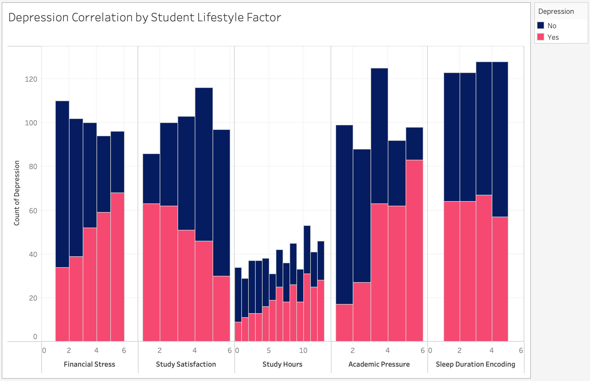

<!-- # Depression Viz  -->
<!-- ```js
const clicks = view(Inputs.button("Click 🙁me"));
```

You have clicked ${clicks} times
 -->

<!-- Load and transform the data -->

<!-- A shared color scale for consistency, sorted by the number of launches -->
<style>
.no-max-width {
    font-size: 50px;
    max-width: none;
}

.large-data-card{
    background: var(--theme-background-alt);
    border: solid 1px var(--theme-foreground-faintest);
    border-radius: 0.55rem;
    padding: 1.5rem;
    font: 14px var(--sans-serif);
    grid-row: span 6;
}

body{
  margin: 0;
  padding: 0.1rem; /* More space between body edge and .section blocks */
  max-width: 100vw;
  font-family: var(--sans-serif);
  box-sizing: border-box;
  overflow: hidden; /* Prevent body-level scrolling */
}
.section {
  position: absolute;
  width: 100%; /* Full width of the viewport */
  height: 100vh;
  margin: 0 auto; /* Center the content */
  padding: 1rem; /* Add some padding for spacing */
  box-sizing: border-box; /* Include padding in width calculation */
  overflow-y: auto; /* Allow section-level scrolling */
  margin-bottom: 20vh;
  opacity: 0;
  visibility: hidden;
  transition: opacity 0.25s ease;
  z-index: 0;
}

.section.active {
      opacity: 1;
      visibility: visible;
      z-index: 1;
    }

.section-content {
      margin: 0 auto;
    }

.scroll-button {
      position: fixed;
      left: 50%;
      transform: translateX(-50%);
      padding: 15px 30px;
      font-size: 1rem;
      background-color: #007BFF;
      color: white;
      border: none;
      border-radius: 25px;
      cursor: pointer;
      box-shadow: 0 4px 10px rgba(0,0,0,0.2);
      z-index: 10;
      opacity: 1;
      transition: opacity 0.3s ease;
    }

    .scroll-button:hover {
      background-color: #0056b3;
    }

    .scroll-button.hidden {
      opacity: 0;
      pointer-events: none;
    }

    #scroll-down {
      bottom: 20px;
    }

    #scroll-up {
      top: 20px;
    }
</style>


```js 
/*
// animating the pages upon scrolling
const featureCards = document.querySelectorAll(".section");

const animateOnScroll = () => {
  featureCards.forEach((card) => {
    const rect = card.getBoundingClientRect();
    if (rect.top < window.innerHeight && rect.bottom > 0) {
      card.classList.add("animate");
    } else {
      card.classList.remove("animate");
    }
  });
};

const animateOnKeyPress = (event) => {
  if (event.key === "ArrowDown" || event.key === "ArrowUp") {
    featureCards.forEach((card) => {
      const rect = card.getBoundingClientRect();
      if (rect.top < window.innerHeight && rect.bottom > 0) {
        card.classList.add("animate");
      } else {
        card.classList.remove("animate");
      }
    });
  }
};

window.addEventListener("scroll", animateOnScroll);
window.addEventListener("keydown", animateOnKeyPress);

featureCards;
*/
```


```js
// pulling in the JSON created from the csv 
const data = FileAttachment("./data/data.json").json();
```

```js
// displaying the json created from the depression data csv
// display(data);

// displaying the d3 svg node created from the depression data
function createChart(){
  const displayData = data; // Modify this if you need to filter or transform the data
  const width = 500, height = 600, margin = { top: 80, right: 50, bottom: 120, left: 50 };
  const r = 8; // Fixed radius
  
  const svg = d3.create("svg")
    .attr("width", width)
    .attr("height", height)
    // .style("background-color", "#F0F0F0");
  
  const g = svg.append("g")
    .attr("transform", `translate(${margin.left}, ${margin.top})`);
  
  const xScale = d3.scaleLinear()
    .domain([0, displayData.length - 1])
    .range([0, width - margin.left - margin.right]);
  
  const yScale = d3.scaleLinear()
    .range([height - margin.top - margin.bottom, 0]);
  
  const yTargets = displayData.map(() => Math.random() * (height - margin.top - margin.bottom));
  
  const simulation = d3.forceSimulation(displayData)
    .force("x", d3.forceX((d, i) => xScale(i)).strength(0.05))
    .force("y", d3.forceY((d, i) => yTargets[i]).strength(0.05))
    .force("collide", d3.forceCollide(r + 4))
    .force("charge", d3.forceManyBody().strength(2))
    .stop();
  
  for (let i = 0; i < 200; ++i) simulation.tick();
  
  const circles = g.selectAll("circle")
    .data(displayData, (d, i) => i);
  
  circles.enter()
    .append("circle")
    .attr("cx", d => d.x)
    .attr("cy", d => d.y)
    .attr("r", r * 1.5)
    .attr("fill", d =>
      d.newEntry ? "#4A90E2" : (d.Depression.toLowerCase() === "yes" ? "#D81B60" : "none")
    )
    .attr("stroke", "#9C1C6C")
    .attr("stroke-width", 1.2)
    .attr("opacity", 0)
    .transition()
    .duration(800)
    .attr("opacity", 1)
    .attr("r", r);
  
  svg.append("text")
    .attr("x", width / 2)
    .attr("y", margin.top / 2)
    .attr("text-anchor", "middle")
    .attr("font-size", "24px")
    .attr("font-weight", "bold")
  
  const tooltip = d3.select("body").append("div")
    .attr("class", "tooltip")
    .style("position", "absolute")
    .style("background", "white")
    .style("padding", "10px")
    .style("border", "1px solid #ccc")
    .style("border-radius", "8px")
    .style("pointer-events", "none")
    .style("font-size", "12px")
    .style("color", "#333")
    .style("box-shadow", "0px 2px 8px rgba(0,0,0,0.15)")
    .style("opacity", 0);
  
  g.selectAll("circle")
    .on("mouseover", function (event, d) {
      tooltip.transition()
        .duration(200)
        .style("opacity", 0.95);
  
      tooltip.html(`
        <strong>Gender:</strong> ${d.Gender}<br/>
        <strong>Age:</strong> ${d.Age}<br/>
        <strong>Academic Pressure:</strong> ${d["StudySatisfaction"]}<br/>
        <strong>Sleep Duration:</strong> ${d["SleepDuration"]}<br/>
        <strong>Dietary Habits:</strong> ${d["DietaryHabits"]}<br/>
        <strong>Suicidal Thoughts:</strong> ${d["SuicidalThoughts"]}<br/>
        <strong>Study Hours:</strong> ${d["StudyHours"]}<br/>
        <strong>Financial Stress:</strong> ${d["FinancialStress"]}<br/>
        <strong>Family History:</strong> ${d["FamilyHistory"]}<br/>
        <strong>Depression:</strong> ${d.Depression}
      `);
    })
    .on("mousemove", function (event) {
      tooltip
        .style("left", (event.pageX + 15) + "px")
        .style("top", (event.pageY - 20) + "px");
    })
    .on("mouseout", function () {
      tooltip.transition()
        .duration(300)
        .style("opacity", 0);
    });
  
  return svg.node();
}
```
<!-- SLIDE 1:  -->
<body>
<div class="section active" id="section-0">
<div class = "section-content">

<div class="grid grid-cols-2">

  <!-- Page Title div -->
  <div class="card grid-colspan-4 grid-rowspan-1" style="display: flex; justify-content: center; align-items: center; text-align: center;">
      <h1 class="no-max-width">
        Mapping Mental Health: Predicting Student Depression Risk
      </h1>
  </div>

  <!-- Insight div -->
  <div class="card grid-rowspan-3">
    <h1>Our interactive tool lets you explore which lifestyle factors impact depression among students - and see how your habits compare. </h1>
  </div>

  <!-- Data div -->
  <div class="large-data-card" id="chart-container" style="display: flex; justify-content:center; flex-wrap: wrap;">
    <h2>Our Data</h2>
    ${display(createChart())}

  </div>

  <!-- User Interaction Div -->
  <div class="card grid-colspan-1 grid-rowspan-3">
    <h1 style="font-size: 15px;">Created by: </h1>
    <p>Srinidhi Jayaprakash, Diego Rivas Lazala, Molly Fei, Stephen Park </p>
  </div>
</div>
</div>
</div>

<!-- SLIDE 2:  -->
<div class="section" id="section-1">
<div class = "section-content">

<div class="grid grid-cols-2">
  <!-- Page Title div -->
  <div class="card grid-colspan-4 grid-rowspan-1" style="display: flex; justify-content: center; align-items: center; text-align: center;">
      <h1 class="no-max-width">
        What Does the Data Say?
      </h1>
  </div>
  <!-- Insight div -->
  <div class="card grid-rowspan-3">
    <h1>Explore how sleep, diet, study time, and more relate to Student Depression. </h1>
  </div>
  <!-- Data div -->
  <div class="large-data-card" id="chart-container" style="display: flex; justify-content:center; flex-wrap: wrap;">
    <h2>Exploring the Data</h2>
    ${display(createChart())}

  </div>
  <!-- User Interaction Div -->
  <div class="card grid-colspan-1 grid-rowspan-3">
    <h1 style="font-size: 15px;">Click on each bubble to see details on each student data point. </h1>
  </div>
</div>
</div>
</div>

<!-- Feature Cards:  -->
<div class="section" id="section-2">
<div class = "section-content">
<div class="grid grid-cols-2">
  <!-- Page Title div -->
  <div class="card grid-colspan-4 grid-rowspan-1" style="display: flex; justify-content: center; align-items: center; text-align: center;">
      <h1 class="no-max-width">
        What Does Your Age and Gender Say?
      </h1>
  </div>
  <!-- Insight div -->
  <div class="card grid-rowspan-3">
    <h1>Insights</h1>
    <h1></h1>
    Younger students tend to report higher levels of depression, possibly due to transitional stress and academic pressure. Additionally, female and non-binary students show higher average depression scores compared to male students, reflecting broader mental health disparities across gender identities.
  </div>
  <!-- Data div -->
  <div class="large-data-card" id="chart-container" style="display: flex; justify-content:center; flex-wrap: wrap;">
    <h1>Depression by Age</h1><br><br>
    *****INSERT CHART HERE*****
    <h1>Depression by Gender</h1>
    *****INSERT CHART HERE*****

  </div>
  <!-- User Interaction Div -->
  <div class="card grid-colspan-1 grid-rowspan-3">
    <h1 style="font-size: 15px;">Curious where you fit in?</h1><br><br>
    <p> Enter Your Gender: </p> <br><br><br>
    <p> Enter Your Gender: </p>
  </div>
</div>
</div>
</div>


<!-- Feature Cards:  -->
<div class="section" id="section-3">
<div class = "section-content">
<div class="grid grid-cols-2">
  <!-- Page Title div -->
  <div class="card grid-colspan-4 grid-rowspan-1" style="display: flex; justify-content: center; align-items: center; text-align: center;">
      <h1 class="no-max-width">
        What Do Your Academic Pressure Levels Say?
      </h1>
  </div>
  <!-- Insight div -->
  <div class="card grid-rowspan-3">
    <h1>Insight for this feature</h1>
    <h1></h1>
    As academic pressure increases, we observe a clear uptick in reported depression levels. Students who rate their academic pressure between 3 and 5 show significantly higher rates of depression than those under less pressure.
  </div>
  <!-- Data div -->
  <div class="large-data-card" id="chart-container" style="display: flex; justify-content:center; flex-wrap: wrap;">
    <h1>Depression by Academic Pressure Levels</h1>
    ${display(createChart())}

  </div>
  <!-- User Interaction Div -->
  <div class="card grid-colspan-1 grid-rowspan-3">
    <h1 style="font-size: 15px;">Curious where you fit in?</h1>
    <p> Rate your academic pressure on a scale from 1 to 5 </p>
  </div>
</div>

</div>
</div>

<!-- Feature Cards:  -->
<div class="section" id="section-4">
<div class = "section-content">

<div class="grid grid-cols-2">
  <!-- Page Title div -->
  <div class="card grid-colspan-4 grid-rowspan-1" style="display: flex; justify-content: center; align-items: center; text-align: center;">
      <h1 class="no-max-width">
        What Do Your Sleep Habits Say?
      </h1>
  </div>
  <!-- Insight div -->
  <div class="card grid-rowspan-3">
    <h1>Insight for this feature</h1>
    <h1></h1>
    While there isn't a strong correlation between sleep duration and depression, students who sleep fewer than 6 hours per night tend to report slightly higher levels of depression compared to their peers.
  </div>
  <!-- Data div -->
  <div class="large-data-card" id="chart-container" style="display: flex; justify-content:center; flex-wrap: wrap;">
    <h1>Depression by Number of Sleep Hours</h1>
    ${display(createChart())}
    
  </div>
  <!-- User Interaction Div -->
  <div class="card grid-colspan-1 grid-rowspan-3">
    <h1 style="font-size: 15px;">Curious where you fit in?</h1>
    <p> Rate your sleep hours on a scale from 1 to 5 </p>
  </div>
</div>

</div>
</div>

<!-- Feature Cards:  -->
<div class="section" id="section-5">
<div class = "section-content">

<div class="grid grid-cols-2">
  <!-- Page Title div -->
  <div class="card grid-colspan-4 grid-rowspan-1" style="display: flex; justify-content: center; align-items: center; text-align: center;">
      <h1 class="no-max-width">
        What Do Your Study Habits and Study Hours Say?
      </h1>
  </div>
  <!-- Insight div -->
  <div class="card grid-rowspan-3">
    <h1>Insights</h1>
    <br>
    Higher satisfaction with studying is linked to lower depression counts; higher study satisfaction can lead to better mental well-being by fostering a sense of accomplishment and reducing stress. <br><br>
    Increased study hours often correlate with higher levels of depression, suggesting that overworking can lead to burnout. 
  </div>
  <!-- Data div -->
  <div class="large-data-card" id="chart-container" style="display: flex; justify-content:center; flex-wrap: wrap;">
    <h1>Depression by Study Satisfaction Levels</h1>
    <!********STUDY SATISFACTION CHART GOES HERE*********!>
    <h1>Depression by Study Hour Levels</h1>
    <!********STUDY HOURS CHART GOES HERE*********!>
    
  </div>
  <!-- User Interaction Div -->
  <div class="card grid-colspan-1 grid-rowspan-3">
    <h1 style="font-size: 15px;">Curious where you fit in?</h1>
    <p> Rate your study satisfaction on a scale from 1 to 5 </p>
    <br><br><br><br>
    <p> Rate your study satisfaction on a scale from 1 to 5 </p>
  </div>
</div>
</div>
</div>


<!-- Feature Cards:  -->
<div class="section" id="section-6">
<div class = "section-content">

<div class="grid grid-cols-2">
  <!-- Page Title div -->
  <div class="card grid-colspan-4 grid-rowspan-1" style="display: flex; justify-content: center; align-items: center; text-align: center;">
      <h1 class="no-max-width">
        What Does Your Financial Stress Say?
      </h1>
  </div>
  <!-- Insight div -->
  <div class="card grid-rowspan-3">
    <h1>Insight for this feature</h1>
    <h1></h1>
    Similar to academic pressure, higher financial stress is strongly linked to increased depression rates. Constant worry about finances, such as debt or instability, can lead to feelings of helplessness and anxiety, which negatively impact mental health and contribute to depression.
  </div>
  <!-- Data div -->
  <div class="large-data-card" id="chart-container" style="display: flex; justify-content:center; flex-wrap: wrap;">
    <h1>Depression by Financial Stress Levels</h1>
    ${display(createChart())}
    
  </div>
  <!-- User Interaction Div -->
  <div class="card grid-colspan-1 grid-rowspan-3">
    <h1 style="font-size: 15px;">Curious where you fit in?</h1>
    <p> Rate your financial stress on a scale from 1 to 5 </p>
  </div>
</div>
</div>
</div>


<!-- Insights Summary Card:  -->
<div class="section" id="section-7">
<div class = "section-content">

<div class="grid grid-cols-2">
  <!-- Page Title div -->
  <div class="card grid-colspan-4 grid-rowspan-1" style="display: flex; justify-content: center; align-items: center; text-align: center;">
      <h1 class="no-max-width">
        Insights Summary from Lifestyle Factors
      </h1>
  </div>
  <!-- Insight div -->
  <div class="card grid-rowspan-3" style="grid-row: span 6;">
    <br><h1 style="font-size: 20px;">What patterns emerge when we compare student life habits with reported depression? Our data shows clear trends between specific stressors and mental health outcomes.?</h1>
    <h1></h1>
    <br><br>
    <p style="font-size: 18px;">Financial Stress: Similar to academic pressure, higher financial stress is strongly associated with higher depression rates.<br><br><br>
    Study Satisfaction: Higher satisfaction with studying is linked to lower depression counts.<br><br><br>
    Academic Pressure: As academic pressure increases, the count of students with depression also increases.<br><br><br>
    Study Hours: More study hours tend to correlate with higher depression, possibly pointing to overwork or burnout.<br><br><br>
    Sleep Duration: Students sleeping less than 6 hours have a slightly higher count of depression, although not a significant difference.</p>
  </div>
  <!-- Data div -->
  <div class="large-data-card" id="chart-container" style="display: flex; justify-content:center; flex-wrap: wrap;">
    <h1>Depression by Financial Stress Levels</h1>
    
  </div>
</div>
</div>
</div>

  <!-- Insights Summary Card:  -->
<div class="section" id="section-8">
<div class = "section-content">

<div class="grid grid-cols-2">
  <!-- Page Title div -->
  <div class="card grid-colspan-4 grid-rowspan-1" style="display: flex; justify-content: center; align-items: center; text-align: center;">
      <h1 class="no-max-width">
        Mental Health Matters
      </h1>
  </div>
  <!-- Insight div -->
  <div class="card grid-rowspan-3" style="grid-row: span 6;">
    <br><h1 style="font-size: 20px;">This machine learning tool is not a medical diagnosis but a reflective resource to help identify patterns in student life related to depression. If you or someone you know is struggling, we strongly encourage seeking support through university counseling services or national mental health resources.</h1>
  </div>
  <!-- Data div -->
  <div class="large-data-card" id="chart-container">
  <br><h1>Links to Resources: </h1>
  <br><br>
  <p>https://www.nimh.nih.gov/get-involved/digital-shareables/mental-health-resources-for-students-and-educators</p><br>
  <p>https://www.mentalhealthfirstaid.org/mental-health-resources/</p><br>
  <p>https://opa.hhs.gov/adolescent-health/mental-health-adolescents/mental-health-resources</p><br>
  <p>https://mhanational.org/youth-mental-health/</p><br>
  </div>
</div>
</div>
</div>


<button id="scroll-up" class="scroll-button hidden" onclick="scrollToPrevious()">↑ Up</button>
<button id="scroll-down" class="scroll-button" onclick="scrollToNext()">↓ Down</button>
<script>
  const sections = document.querySelectorAll('.section');
    const btnUp = document.getElementById('scroll-up');
    const btnDown = document.getElementById('scroll-down');
    let currentIndex = 0;
    let isTransitioning = false;
    function updateButtons() {
      btnUp.classList.toggle('hidden', currentIndex === 0);
      btnDown.classList.toggle('hidden', currentIndex === sections.length - 1);
    }
    function transitionToSection(index) {
      if (isTransitioning || index === currentIndex || index < 0 || index >= sections.length) return;
      isTransitioning = true;
      const current = sections[currentIndex];
      const next = sections[index];
      current.classList.remove('active');
      // Wait for fade out, then show new section
      setTimeout(() => {
        next.scrollTop = 0; // Reset scroll position
        next.classList.add('active');
        currentIndex = index;
        updateButtons();
        isTransitioning = false;
      }, 250); // Must match CSS transition time
    }
    function scrollToNext() {
      transitionToSection(currentIndex + 1);
    }
    function scrollToPrevious() {
      transitionToSection(currentIndex - 1);
    }
    // Prevent manual section switching
    window.addEventListener('keydown', e => {
      const keys = ['ArrowDown', 'ArrowUp', 'PageDown', 'PageUp', ' '];
      if (keys.includes(e.key)) {
        e.preventDefault();
      }
    });
    updateButtons();
</script>
</body>
